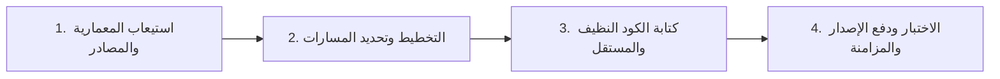

# بروتوكول التنفيذ للوكلاء الأذكياء (Pre-Execution Workflow)

لكل مهمة برمجية يقوم بها الذكاء الاصطناعي في بيئة أوغاريت، يجب تطبيق الخطوات الأربع التالية:

### 1. استيعاب المعمارية والمصادر
* فحص التوجيهات ذات الصلة في `knowledgebase`.
* مراجعة مستودعات المصادر المقابلة في `sources/` (مثل حزم `levantc`).
* التأكد من عدم انتهاك أي قاعدة من قواعد التسميات أو الاستقلال البرمجي.

### 2. التخطيط
* تحديد الملفات المستهدفة بالضبط.
* توضيح التغييرات المعمارية قبل التعديل في حال كانت التعديلات كبرى.

### 3. كتابة الكود النظيف
* الالتزام التام برخصة MIT وديباجة الملكية الفكرية الرسمية للأستاذ معاذ أبو عودة.
* توجيه مساحات الأسماء إلى `Heritage\...` وحزم `ugarit/*` أو `ugaritco/*`.

### 4. الاختبار والتحقق والدفع
* التحقق من سلامة بناء الكود وخلوه من أخطاء بناء الجملة (Syntax Errors).
* تشغيل التحليل الساكن واختبارات Pest إن وجدت.
* تحديث التاج وفق نمط `1.00.00` ودفع التعديلات وتزامنها مع Packagist.
