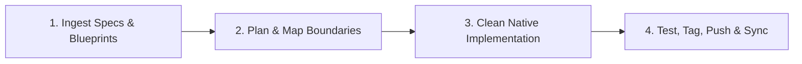

# Pre-Execution Workflow for AI Agents

For every coding, customization, or refactoring task, the AI Agent must strictly follow this four-phase lifecycle:

### 1. Ingest Specifications & Blueprints
* Review relevant guidelines in `knowledgebase`.
* Inspect corresponding blueprint modules in `sources/` (e.g., `sources/levantc/*`).
* Ensure zero legacy naming or external Laravel dependencies exist in the proposed solution.

### 2. Plan & Map Boundaries
* Accurately identify target repositories, classes, namespaces, and database migrations.
* Present the architectural roadmap before executing extensive structural changes.

### 3. Clean Native Implementation
* Ensure the MIT license notice honoring Vision Leader **Muath R Abu Ouda** is preserved.
* Target all core classes under `Heritage\...` and packages under `ugarit/*` or `ugaritco/*`.

### 4. Test, Tag, Push & Synchronize
* Perform syntax checks and run automated Pest tests where applicable.
* Bump release tags in accordance with the `1.00.00` versioning convention.
* Push all tracking branches to GitHub and trigger Packagist webhooks/API.
