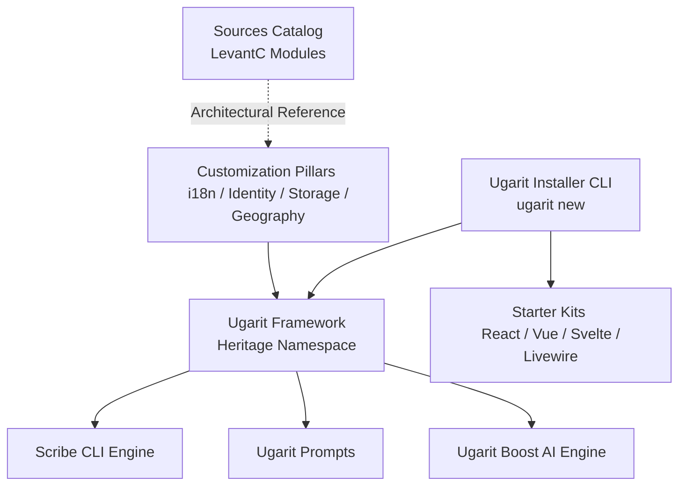

# Ecosystem Architecture & Repository Map

The Ugarit ecosystem consists of central packages arranged in a distinct hierarchical architecture:

---

## 1. Core Packages
* **`ugarit/framework`** (`j:\ugarit\framework`):
  The self-contained foundation managing service containers, routing, Eloquent ORM, events, and HTTP lifecycle under the `Heritage\...` namespace.
* **`ugarit/installer`** (`j:\ugarit\installer`):
  The official CLI tool for scaffolding new Ugarit applications (`ugarit new`).
* **`ugarit/prompts`** (`j:\ugarit\prompts`):
  Interactive terminal prompt engine tailored for beautiful CLI experiences.
* **`ugarit/boost`** (`j:\ugarit\boost`):
  AI-assisted engineering tool providing guidelines, agent skills, and Model Context Protocol (MCP) servers.
* **`ugaritco/pest-plugin-ugarit`** (`j:\ugarit\pest-plugin-ugarit`):
  Pest testing plugin tailored for the Ugarit application architecture.

---

## 2. Official Starter Kits
* `react-starter-kit` (and `blank-react-starter-kit`)
* `vue-starter-kit` (and `blank-vue-starter-kit`)
* `svelte-starter-kit` (and `blank-svelte-starter-kit`)
* `livewire-starter-kit` (and `blank-livewire-starter-kit`)
* `api-starter-kit`
