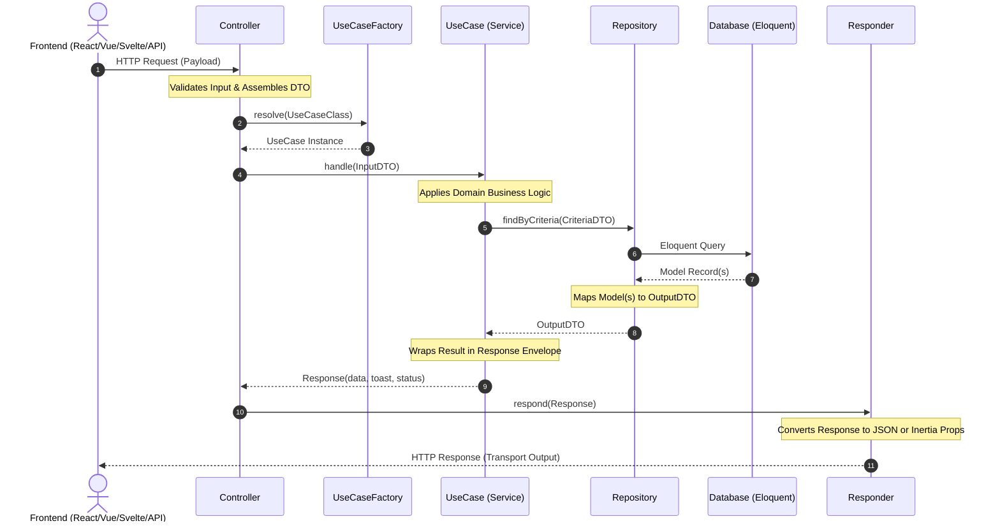

# Artifact-Driven Architecture (ADA) & The Decoupled Core

> [!IMPORTANT]
> **The Architectural Soul of Ugarit:**
> This document defines the definitive architectural blueprint of the Ugarit Ecosystem. Derived from the battle-tested layer-isolation principles of LevantC Core, this architecture elevates the paradigm by combining a **Feature-Empowered Core** with autonomous **Artifacts** and enforcing **Absolute Frontend-Backend Decoupling**.

---

## 1. Core Paradigm Shift: From Silent Core to Feature-Empowered Core

In the predecessor LevantC architecture, the system was organized around a "Silent Core" that acted purely as a pass-through orchestrator.

Ugarit fundamentally elevates this model:
1. **Feature-Empowered Core:**
   * The host application is **not** an empty shell.
   * It provides native core features directly out-of-the-box: central security pipelines, event buses, telemetry, caching topologies, and unified bootstrapping.
2. **Artifact-Driven Modularity:**
   * Domain packages and modular extensions are formally designated as **`Artifacts`** (replacing the generic term "modules").
   * An **Artifact** is an autonomous, self-contained backend capability adhering to strict layer boundaries.

---

## 2. Absolute Frontend-Backend Decoupling (The Zero-Knowledge Principle)

A cornerstone rule of Ugarit's architecture is the **absolute, non-negotiable isolation** between the frontend and the backend.

```mermaid
graph LR
    subgraph Frontend_Ecosystem ["Fluid Frontend Ecosystem (Multiple Choices)"]
        React[React Starter Kit]
        Vue[Vue Starter Kit]
        Svelte[Svelte Starter Kit]
        Livewire[Livewire Starter Kit]
        Headless[Headless API / Mobile Clients]
    end

    subgraph Transport_Boundary ["Standardized Contract / API Boundary"]
        Responders[Responders & DTO Envelopes]
    end

    subgraph Backend_Ecosystem ["Immutable Backend Ecosystem (Constant)"]
        Core[Feature-Empowered Core]
        Artifacts[Artifacts / art Engine]
    end

    Frontend_Ecosystem <==>|Zero-Knowledge HTTP / Inertia Protocol| Transport_Boundary
    Transport_Boundary <==>|Typed Use Cases & DTOs| Backend_Ecosystem
```



### The Decoupling Rules:
1. **Backend is Constant, Frontend is Fluid:**
   * The backend domain logic, schemas, and processing rules are stable, deterministic, and enterprise-grade.
   * The frontend represents interchangeable user experience paradigms (React, Vue, Svelte, Livewire, mobile apps, or headless micro-frontends).
2. **Artifacts Contain ZERO Frontend Assets:**
   * An Artifact **must never** contain Blade views, Vue/React components, CSS sheets, or frontend asset build configurations.
   * Artifacts operate exclusively as backend computational and data engines.
3. **The Frontend Knows Nothing About Backend Internals:**
   * The frontend is completely agnostic of Eloquent models, database schemas, repository queries, or server-side design patterns.
   * The frontend only communicates through transport endpoints and consumes structured, typed data payloads.
4. **The Backend Knows Nothing About Frontend View Logic:**
   * Backend controllers and use cases never render HTML or manipulate UI state directly.
   * Output formatting is delegated strictly to **Responders**, which shape the data into the transport format requested by the client (JSON, Inertia payload, or redirect semantics).

---

## 3. Anatomical Structure of an Artifact

All domain artifacts reside within the `artifacts/` directory. Every artifact must feature the central **`art`** entrypoint file:

```text
artifacts/<artifact-name>/
├── art.php                     # The Primary Artifact Manifest & Binding Descriptor
├── composer.json               # Package identity & autoloading (ugaritco/<artifact>)
├── database/
│   └── migrations/             # Schema definitions and data migrations
├── src/
│   ├── Actions/                # Action descriptors (toasts, alerts, feedback payloads)
│   ├── Contracts/              # Strict public API interfaces
│   ├── DTOs/                   # Strongly-typed Data Transfer Objects
│   ├── Enums/                  # Domain constants and typed state values
│   ├── Events/                 # Broadcast-ready domain events
│   ├── Factories/              # UseCase and Repository resolver factories
│   ├── Http/
│   │   ├── Controllers/        # Dispatchers only (strictly zero business rules)
│   │   ├── Requests/           # HTTP form requests & payload validation
│   │   └── Responders/         # Transport adapters (JSON, Inertia, Redirect)
│   ├── Models/                 # Internal Eloquent models (never leaked outside)
│   ├── Providers/              # Artifact service provider and lifecycle bindings
│   ├── Repositories/           # Persistence abstraction; Eloquent-to-DTO mappers
│   ├── Responses/              # Standardized UseCase outcome envelopes
│   └── Services/               # Domain UseCases orchestrating business logic
└── tests/                      # Dedicated Pest test suite
```

---

## 4. The `art.php` Manifest Specification

Every artifact is defined by an `art.php` (or `art`) entrypoint at its root. This descriptor tells the Ugarit Core how to load, register, and configure the artifact:

```php
<?php

declare(strict_types=1);

namespace Ugarit\Artifacts\Identity;

use Heritage\Support\Artifact;

return new class extends Artifact
{
    /**
     * The unique identifier for the artifact.
     */
    public string $id = 'identity';

    /**
     * The human-readable name of the artifact.
     */
    public string $name = 'Identity & Access Management';

    /**
     * The semantic version of the artifact.
     */
    public string $version = '1.00.00';

    /**
     * Service providers registered by this artifact.
     */
    public array $providers = [
        Providers\IdentityServiceProvider::class,
    ];

    /**
     * Dependencies required by this artifact.
     */
    public array $requires = [
        // IDs of prerequisites, e.g., 'i18n'
    ];

    /**
     * Boot logic for the artifact.
     */
    public function boot(): void
    {
        // Internal artifact initialization
    }
};
```

---

## 5. Architectural Layer Isolation Rules (DDD)

Within every artifact, code is strictly segregated into dedicated, decoupled layers:

| Layer | Responsibility | Strict Invariant |
| :--- | :--- | :--- |
| **Http / Controllers** | HTTP request entry point & dispatching | **Zero business rules.** Delegates immediately to a Use Case via a typed DTO, then hands the result to a Responder. |
| **DTOs** | Structured data transfer objects | **Immutable and typed.** Explicit input and output shapes; never leaks raw request arrays. |
| **Services / Use Cases** | Domain orchestration & business logic | **Single Responsibility.** Accepts a DTO, executes rules via Repository interfaces, and returns a standardized `Response` envelope. |
| **Repositories** | Persistence & database interaction | **Model encapsulation.** Queries Eloquent models and maps them into DTOs. **Never leaks Eloquent models past the repository layer.** |
| **Contracts** | Public interface boundaries | Interfaces defining all inter-layer and inter-artifact communication, guaranteeing testability and mockability. |
| **Responses** | Standardized execution outcomes | Encapsulates the execution result: status, payload data, error messages, and user feedback metadata. |
| **Responders** | Transport layer translation | Adapts the agnostic `Response` object into JSON, Inertia page props, or HTTP redirects without touching business logic. |
| **Actions** | User feedback descriptors | Defines side-effect descriptors such as toast notifications, confirmation dialog triggers, or client redirects. |

---

## 6. End-to-End Request Pipeline Flow

The following diagram illustrates the complete execution pipeline for a typical request in the Artifact-Driven Architecture:



---

## 7. Strategic Architectural Advantages

1. **Unconstrained Frontend Evolution:**
   * Switching frontend frameworks (e.g., from Vue to React, or adding a Flutter mobile client) requires **zero modifications** to backend artifacts.
2. **Isolated Testability:**
   * Every layer can be tested in isolation: UseCases are tested with mocked repository contracts, controllers are tested via HTTP integration tests, and repositories are tested against database fixtures.
3. **Clean Team Division:**
   * Backend engineers focus exclusively on domain logic, data integrity, security, and performance.
   * Frontend engineers focus entirely on UX, accessibility, aesthetics, and reactive components using their preferred starter kit.
4. **Horizontal Scalability:**
   * New system capabilities are introduced by creating a new `artifacts/<name>/` package with its `art.php` manifest, keeping the Core clean and eliminating monolithic bloat.
