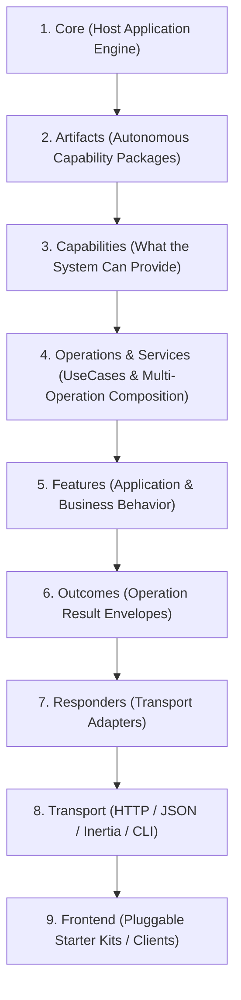
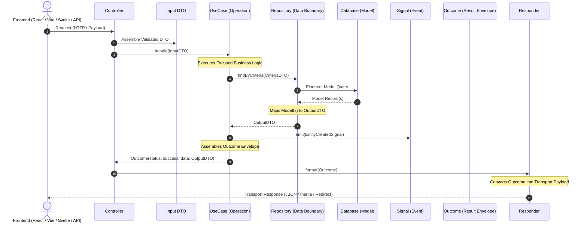

# Artifact-Driven Architecture (ADA)

> [!IMPORTANT]
> **The Official Technical Reference for ADA:**
> **"Artifacts provide capabilities. Features define behavior."**
>
> Artifact-Driven Architecture (ADA) is the concrete architectural implementation of the Ugarit philosophy. It establishes strict layer isolation, guarantees zero-knowledge decoupling between frontend and backend, and structures application logic around autonomous, capability-bearing **Artifacts**.

---

## 1. The Core Architectural Hierarchy

ADA organizes system execution in a strict top-to-bottom pipeline:



### Stage-by-Stage Breakdown

1. **Core:**
   The foundational host application environment (`Heritage\...`). It provides the container, configuration, telemetry, global middleware, security pipelines, and bootstrapping.
2. **Artifacts:**
   Autonomous technical packages residing under `artifacts/<name>/` registered via an `art.php` manifest.
3. **Capabilities:**
   The atomic technical abilities provided by Artifacts (e.g., token issuance, image resizing, translation extraction, multi-tenant scoping).
4. **Operations / Services:**
   * **Operation (`UseCase`):** A focused, discrete business execution unit with a single responsibility.
   * **Service:** A composition of multiple operations executing a cohesive multi-step workflow.
5. **Features:**
   Application-level business behavior. Features orchestrate one or more Artifact Capabilities to deliver business value.
6. **Outcomes:**
   The standardized result of an operation (replaces the architectural concept of `Response`). An Outcome encapsulates status, data payload, errors, and user feedback metadata (toasts/alerts).
7. **Responders:**
   Boundary translators that convert an agnostic `Outcome` into a specific transport format without altering business logic.
8. **Transport:**
   The communication wire protocol (HTTP JSON response, Inertia page props, HTTP redirects, or CLI output).
9. **Frontend:**
   The fluid, pluggable presentation tier (React, Vue, Svelte, Livewire, or mobile apps) operating on the Zero-Knowledge principle.

---

## 2. The Golden Dependency Invariant

$$\mathbf{Feature \longrightarrow Artifact}$$
$$\mathbf{Artifact \;\cancel{\longrightarrow}\; Feature}$$

```text
┌────────────────────────────────────────────────────────┐
│                        FEATURE                         │
│             (Application Business Behavior)            │
│                                                        │
│   Composes: Identity Capability + i18n Capability      │
└───────────────────────────┬────────────────────────────┘
                            │
                            ▼ (Allowed: Feature depends on Artifacts)
┌────────────────────────────────────────────────────────┐
│                       ARTIFACT                         │
│             (Independent Technical Unit)               │
│                                                        │
│   Provides: Storage, Identity, i18n, Attributes        │
│                                                        │
│   ❌ NEVER imports or references Features              │
└────────────────────────────────────────────────────────┘
```

* **Features know Artifacts:** A feature (e.g., "User Onboarding Flow") imports use cases and capabilities from the `identity` artifact, `i18n` artifact, and `storage` artifact.
* **Artifacts NEVER know Features:** An artifact has zero knowledge of the features that consume it. It exposes contracts, repositories, DTOs, and use cases as reusable capabilities.

---

## 3. The Zero-Knowledge Principle (Frontend-Backend Decoupling)

* **Backend is Constant:** The domain models, business operations, outcomes, and storage pipelines are immutable across client implementations.
* **Frontend is Fluid:** Developers choose any frontend implementation (React, Vue, Svelte, Livewire, Mobile, or CLI).
* **Zero View Code in Artifacts:** Artifacts **never** contain Blade templates, Inertia components, React/Vue assets, or stylesheets.
* **Agnostic Outcomes:** UseCases return an **`Outcome`**, which the **`Responder`** maps into whatever the current frontend demands.

---

## 4. Anatomical Structure of an Artifact

Each artifact lives in `artifacts/<name>/` and follows this exact layer structure:

```text
artifacts/<artifact-name>/
├── art.php                     # The Primary Artifact Manifest & Binding Descriptor
├── composer.json               # Package identity (ugaritco/<artifact>)
├── database/
│   └── migrations/             # Schema definitions and data migrations
├── src/
│   ├── Actions/                # Action & feedback descriptors (toasts, client redirects)
│   ├── Contracts/              # Interface boundaries for inter-layer abstraction
│   ├── DTOs/                   # Immutable typed Data Transfer Objects
│   ├── Enums/                  # Domain constants and typed state values
│   ├── Factories/              # UseCase, Service, and Repository resolvers
│   ├── Http/
│   │   ├── Controllers/        # Dispatchers only (zero business logic)
│   │   ├── Requests/           # Input validation and DTO assembly
│   │   └── Responders/         # Translates Outcomes into transport payloads
│   ├── Models/                 # Eloquent persistence models (never leaked outside)
│   ├── Outcomes/               # Standardized operation outcome envelopes
│   ├── Providers/              # Service providers registering artifact capabilities
│   ├── Repositories/           # Data source boundary; Eloquent-to-DTO mapping
│   ├── Services/               # Composite services & focused UseCases (Operations)
│   ├── Signals/                # System notification events (Signals)
│   └── Traits/                 # Shared internal reusable behaviors
└── tests/                      # Dedicated Pest test suite
```

---

## 5. Architectural Layer Isolation Rules

| Layer | Type | Invariant & Responsibility |
| :--- | :--- | :--- |
| **`Controller`** | Dispatcher | Accepts HTTP input, triggers validation, instantiates a DTO, executes a UseCase/Service, and passes the **Outcome** to a **Responder**. **Zero business rules.** |
| **`DTO`** | Data Container | Strongly typed, immutable data structures representing explicit input and output shapes. |
| **`UseCase`** | Operation | Encapsulates a single focused business operation. Accepts a DTO, interacts with Repositories via Contracts, emits **Signals**, and returns an **Outcome**. |
| **`Service`** | Composition | Coordinates multiple UseCases or complex multi-step domain workflows. |
| **`Repository`** | Data Boundary | Mediates between domain logic and persistence. Maps Models to DTOs. **Never leaks Eloquent Models beyond the repository layer.** |
| **`Model`** | Persistence | Eloquent active record entities. Strictly encapsulated within the artifact's repository layer. |
| **`Signal`** | Notification | Replaces the architectural concept of `Event`. Broadcast-ready notification that an operation completed or a domain state changed. |
| **`Outcome`** | Envelope | Replaces the architectural concept of `Response`. Contains status (`success`, `failed`, `validation_error`), data payload, and client action descriptors. |
| **`Responder`** | Adapter | Formats the **Outcome** into transport representations: JSON, Inertia page props, CLI terminal tables, or HTTP redirects. |
| **`Contract`** | Interface | Defines public contracts for mockability, decoupling, and dependency injection. |

---

## 6. End-to-End Execution Flow



---

## 7. The `art.php` Specification

Every artifact declares its capabilities and dependencies via `art.php`:

```php
<?php

declare(strict_types=1);

namespace Ugarit\Artifacts\Identity;

use Heritage\Support\Artifact;

return new class extends Artifact
{
    /**
     * The unique identifier for the artifact.
     */
    public string $id = 'identity';

    /**
     * The human-readable name of the artifact.
     */
    public string $name = 'Identity & Access Management';

    /**
     * The semantic version of the artifact.
     */
    public string $version = '1.00.00';

    /**
     * The technical capabilities provided by this artifact.
     *
     * @var array<string, string>
     */
    public array $capabilities = [
        'authentication' => 'User authentication, sessions, and token management',
        'authorization'  => 'Role-based access control and policy enforcement',
        'passkeys'       => 'WebAuthn hardware passkey authentication',
    ];

    /**
     * Service providers registered by this artifact.
     */
    public array $providers = [
        Providers\IdentityServiceProvider::class,
    ];

    /**
     * Dependencies on other artifact capabilities.
     */
    public array $requires = [
        // 'i18n.translations',
    ];

    /**
     * Boot logic for the artifact.
     */
    public function boot(): void
    {
        // Capability bootstrap logic
    }
};
```
