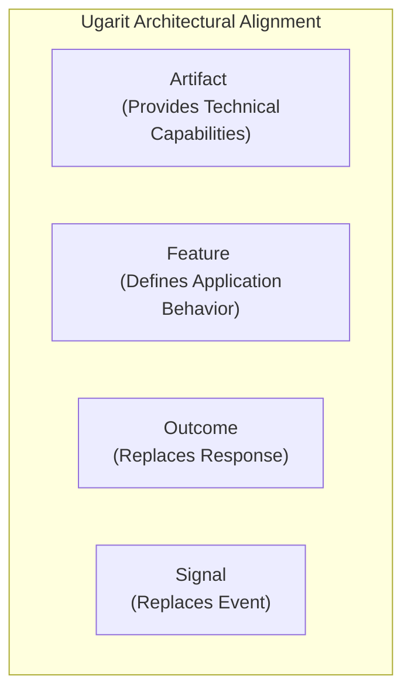

# The Ugarit Philosophy: Architectural Sovereignty & The Artifact Era

> [!IMPORTANT]
> **The Core Axiom of Ugarit:**
> **"Artifacts provide capabilities. Features define behavior."**
>
> Guided by Vision Leader **Muath R Abu Ouda**, this document serves as the philosophical North Star for the entire Ugarit Ecosystem. Every design decision, code review, and architectural extension must align with this philosophy.

---

## 1. The Foundational Axioms

Ugarit is built upon a fundamental conceptual separation between technical capability and business behavior:

### 1.1 Artifact vs. Feature
* **Artifact (The Technical Unit):**
  An independent, self-contained technical package residing under `artifacts/<name>/`. Its sole purpose is to provide reusable technical **Capabilities**. An Artifact has no awareness of end-user product workflows or application-specific intent.
* **Capability (The Technical Ability):**
  What the system is technically equipped to provide (e.g., identity verification, file persistence, dynamic key translation, geographical coordinate resolution).
* **Feature (The Application Behavior):**
  Application-level business behavior. A Feature solves a user-facing or domain-specific problem by composing operations and capabilities across one or multiple Artifacts.

### 1.2 The Immutable Directional Invariant
The dependency relationship between Features and Artifacts is strictly unidirectional:

$$\mathbf{Feature \longrightarrow Artifact}$$
$$\mathbf{Artifact \;\cancel{\longrightarrow}\; Feature}$$

* **Features compose Artifacts:** Application features import, invoke, and orchestrate capabilities provided by underlying Artifacts.
* **Artifacts NEVER depend on Features:** An Artifact must never import, reference, or assume the presence of a Feature. Artifacts remain universally reusable and isolated.

---

## 2. The Architectural Lexicon & Concepts

Ugarit preserves industry-standard terminology where it works best, introducing focused terms only where conceptual precision is vital:

| Term | Concept & Role | Architectural Rule |
| :--- | :--- | :--- |
| **`Artifact`** | Independent technical unit providing technical capabilities | Lives in `artifacts/<name>/` with an `art.php` manifest; self-contained. |
| **`Capability`** | What the system can technically deliver | The atomic unit of functionality exposed by an Artifact. |
| **`Feature`** | Business and application behavior | Composes capabilities from one or more Artifacts. |
| **`UseCase`** | A focused, single-purpose operation | Encapsulates one discrete business action with clear input and output boundaries. |
| **`Service`** | Composition of multiple operations | Orchestrates complex multi-step domain logic. |
| **`Outcome`** | The result of an operation (replaces `Response`) | An agnostic result object carrying status, payload data, and client feedback descriptors. |
| **`Responder`** | Transport adapter | Translates an agnostic `Outcome` into a transport format (JSON, Inertia props, CLI, Redirect). |
| **`Signal`** | Notification of occurrence (replaces `Event`) | Broadcast-ready domain notification that something noteworthy took place. |
| **`Repository`** | Data Source Boundary | Mediates between domain logic and persistence; maps Models to DTOs; never leaks Models past its boundary. |
| **`Model`** | Persistence entity | Standard Eloquent model representing database tables. |

### Preserved Standard Constructs
Ugarit explicitly avoids renaming things simply for the sake of novelty. The following names remain standard:
* **`Model`**
* **`Repository`**
* **`Service`**
* **`UseCase`**
* **`Contracts`**
* **`DTOs`**
* **`Factories`**
* **`Providers`**
* **`Listeners`**
* **`Traits`**

---

## 3. The Zero-Knowledge Decoupling Doctrine

The Backend is an **immutable, constant engine**. The Frontend is a **fluid, pluggable ecosystem**.

```mermaid
graph LR
    subgraph Frontend_Tiers ["Fluid Frontend Choices"]
        React[React Starter Kit]
        Vue[Vue Starter Kit]
        Svelte[Svelte Starter Kit]
        Livewire[Livewire Starter Kit]
        Clients[Mobile / CLI / API Clients]
    end

    subgraph Boundary ["Contract & Transport Boundary"]
        Responders[Responders & Outcomes]
    end

    subgraph Backend_Core ["Constant Backend Core"]
        Core[Feature-Empowered Core]
        Artifacts[Artifact Capabilities]
    end

    Frontend_Tiers <==>|Zero-Knowledge Transport Protocol| Boundary
    Boundary <==>|Typed UseCases & DTOs| Backend_Core
```

1. **Artifacts Contain Zero Frontend Code:**
   No Blade views, Inertia components, React/Vue assets, or client CSS/JS bundles reside within Artifacts.
2. **The Frontend Knows Nothing of Backend Internals:**
   The client has zero awareness of Eloquent models, database schemas, repository queries, or server pipelines.
3. **The Backend Knows Nothing of Frontend Presentation:**
   Controllers execute UseCases, receive an **`Outcome`**, and delegate to **`Responders`** to emit the appropriate transport format.

---

## 4. Source Ingestion & Adaptation Strategy

Ugarit respects intellectual property while pursuing uncompromising sovereignty:
* **Blueprints, Not Dependencies:** Systems located in `sources/` (e.g., `sources/levantc/*`) serve as architectural reference blueprints.
* **Absorb, Adapt, Elevate:** We study proven contracts, repositories, and workflows, then natively re-engineer them under `Heritage\...` without importing any legacy external dependencies (`laravel/*`, `illuminate/*`).
* **Sovereignty First:** All releases adhere to `v1.xx.xx` semver under `ugarit` and `ugaritco` organizations, honoring Vision Leader **Muath R Abu Ouda**.
