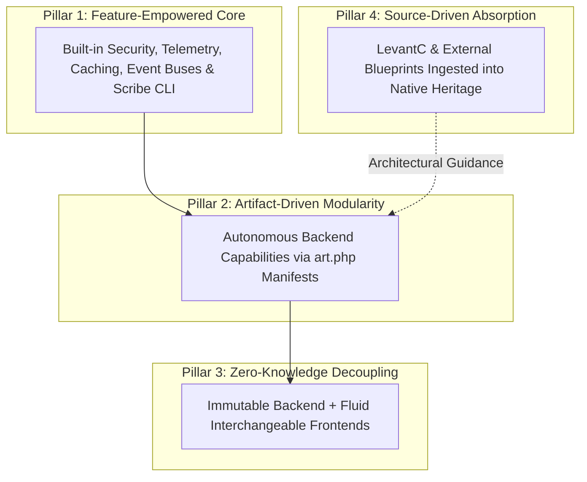
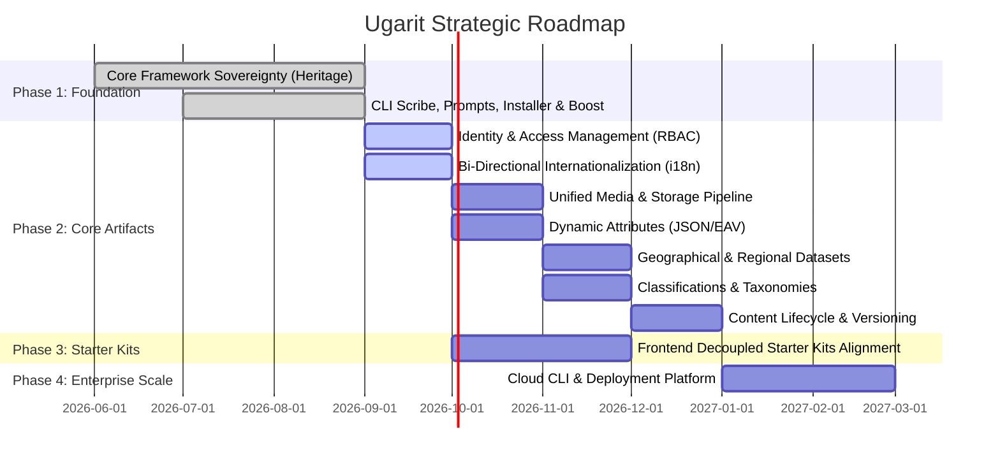

# The Ugarit Ecosystem Strategy: Architectural Sovereignty & The Artifact Era

> [!IMPORTANT]
> **The Strategic Blueprint of Ugarit:**
> This document establishes the master strategy, philosophical doctrine, and execution roadmap for the **Ugarit Ecosystem**. Guided by Vision Leader **Muath R Abu Ouda**, this strategy defines how Ugarit transitions from an independent framework into a sovereign, enterprise-grade application ecosystem.

---

## 1. Executive Strategic Vision

The mission of Ugarit is to establish an **independent, Arabic-first, globally competitive web platform engineering ecosystem**. 

Rather than merely providing a foundation for writing code, Ugarit provides a complete architectural paradigm that guarantees:
* **Architectural Sovereignty:** Absolute isolation from external legacy framework dependencies (`laravel/*`, `illuminate/*`). All core capabilities reside natively within `Heritage\...` under `ugarit` and `ugaritco`.
* **Zero-Knowledge Decoupling:** Complete separation of concerns where the backend is deterministic and constant, while the frontend is flexible, pluggable, and interchangeable.
* **Modular Enterprise Scalability:** System growth driven by autonomous **Artifacts** powered by the **`art`** engine.

---

## 2. The Four Strategic Pillars of Ugarit

The entire ecosystem is anchored upon four immutable architectural pillars:

### Pillar 1: The Feature-Empowered Core (Beyond the Silent Core)
* Unlike conventional architectures that reduce the host application to an empty, passive router ("Silent Core"), the Ugarit Core provides foundational capabilities natively:
  * Unified container orchestration and service provider lifecycles.
  * Native security middleware, rate limiting, and session integrity.
  * Centralized event dispatching, queuing, and scheduled command execution.
  * The **`scribe`** CLI engine for developer tooling and automation.

### Pillar 2: Artifact-Driven Modularity (`art` Engine)
* System capabilities expand horizontally through self-contained **`Artifacts`** residing in `artifacts/<name>/`.
* Every artifact is governed by an **`art.php`** descriptor that specifies identity, semver versioning (`1.xx.xx`), dependency trees, and service provider bindings.
* Keeps the core lean while allowing unlimited domain capabilities to be installed, updated, or removed without breaking system integrity.

### Pillar 3: The Zero-Knowledge Decoupling Principle
* **Backend Invariant:** Artifacts are strictly backend-only computational engines. An artifact **never** contains Blade templates, Vue/React components, or CSS/JS bundles.
* **Frontend Fluidity:** Developers can seamlessly select and switch between official Starter Kits (`react-starter-kit`, `vue-starter-kit`, `svelte-starter-kit`, `livewire-starter-kit`, or Headless/Mobile clients) without modifying a single line of backend artifact logic.
* **Transport Agnosticism:** Communication across the boundary is mediated exclusively by typed **DTOs** and **Responders**, translating domain responses into JSON APIs, Inertia page props, or redirect flows dynamically.

### Pillar 4: Source-Driven Blueprint Ingestion
* Reference systems placed within `sources/` (specifically the 14 core modules of `sources/levantc`) serve as architectural and functional blueprints.
* Proven patterns are absorbed, adapted, and elevated into native `Heritage\...` implementations without importing any external dependencies.

---

## 3. Strategic Execution Roadmap

The implementation of the Ugarit Strategy progresses through four distinct phases:

### Phase 1: Sovereign Foundation & Tooling (Accomplished)
* Framework decoupling and rebranding under `Heritage\...`.
* `scribe` CLI runner, `ugarit/prompts`, and `ugarit/boost` AI engine.
* `ugarit/installer` (`ugarit new`) with full Windows compatibility and ANSI colors.
* Unified versioning standard established (`v1.00.00`+).

### Phase 2: Core Artifacts Development (Current Priority)
Engineering the foundational backend Artifacts following the 7 Customization Pillars:
1. **`artifacts/identity`**: Multi-role RBAC, Passkeys (WebAuthn), session guard, multi-tenancy.
2. **`artifacts/i18n`**: Bi-directional layout engine (RTL/LTR), morphological Arabic rules, dynamic translation stores.
3. **`artifacts/storage`**: Multi-disk pipelines, automatic WebP/AVIF transformations, asset metadata.
4. **`artifacts/attributes`**: High-performance typed EAV engine powered by native JSON columns.
5. **`artifacts/geography`**: Comprehensive global and MENA geographical datasets and ISO registries.
6. **`artifacts/classification`**: Nested set tree taxonomies and polymorphic taggers.
7. **`artifacts/versioning`**: Audit logs, unified diff generation, and point-in-time state recovery.

### Phase 3: Starter Kits Harmonization
* Refactoring official starter kits (`React`, `Vue`, `Svelte`, `Livewire`) to consume Artifacts strictly via typed Responders and DTO contracts.
* Ensuring zero backend logic leaks into the frontend templates.

### Phase 4: Enterprise Cloud & Ecosystem Expansion
* Rollout of Ugarit Cloud CLI, production orchestration, and developer community portals.

---

## 4. Engineering Governance & Quality Standards

Every line of code and every release across the Ugarit ecosystem must satisfy the following governance mandates:

1. **The MIT License Standard:**
   All files must include the official copyright header honoring Vision Leader **Muath R Abu Ouda**.
2. **Zero-Laravel Import Policy:**
   Static analysis rules (`ugaritstan`) and CI checks automatically fail if any `Illuminate\` or `Laravel\` symbol is imported outside legal license notices.
3. **The Two-Digit SemVer Rule (`1.xx.xx`):**
   Predictable zero-padded releases (`v1.00.00`, `v1.00.01`, `v1.01.00`). Inherited legacy tags are permanently banned.
4. **Conventional Commits:**
   Strict adherence to `type(scope): imperative summary`.
5. **Automated Testing Discipline:**
   Every Artifact must ship with isolated **Pest** test suites executed via `php scribe test`.
6. **Cross-Platform Excellence:**
   Flawless operation across Windows (PowerShell, CP-720 encoding, non-blocking I/O) and UNIX-based servers.
