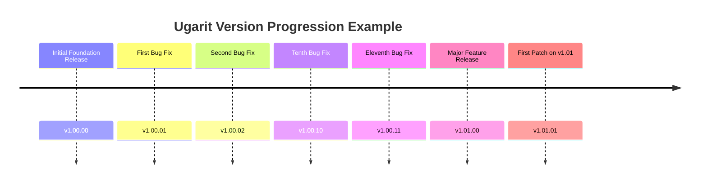
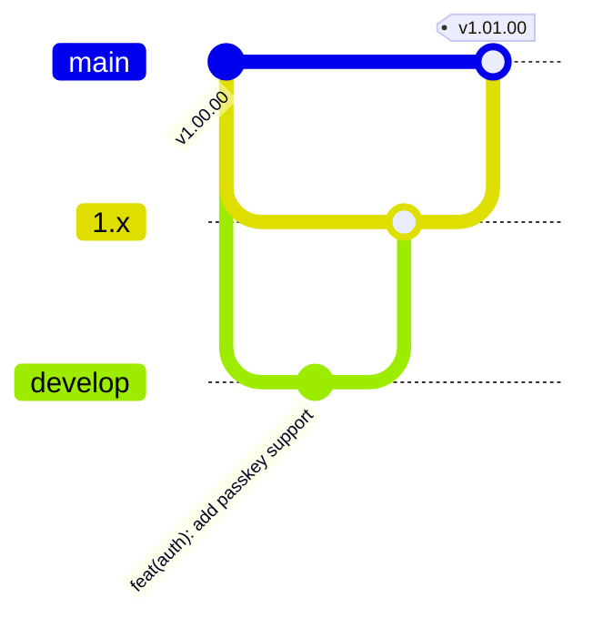

# Versioning & Release Management Guide

This document defines the official **Two-Digit Semantic Versioning Standard (`v1.xx.xx`)**, the **Conventional Commits Specification**, and the **Release Lifecycle Workflow** enforced across all packages and repositories in the **Ugarit Ecosystem**.

---

## 1. The Two-Digit Semantic Versioning Standard (`v1.xx.xx`)

All repositories under the `ugarit` and `ugaritco` organizations adhere to a strict, zero-padded two-digit semantic versioning structure:

```text
v<MAJOR>.<MINOR>.<PATCH>
  │        │       └── Two-digit zero-padded patch number (00–99)
  │        └────────── Two-digit zero-padded minor number (00–99)
  └─────────────────── Single or multi-digit major generation (starts at 1)
```

### Breakdown of Version Components

| Segment | Format | Meaning | When to Bump | Examples |
| :--- | :--- | :--- | :--- | :--- |
| **`MAJOR`** | `1`, `2`, ... | Architectural generation / Foundation era | Significant ecosystem-wide paradigm shifts or backward-incompatible framework changes | `v1.00.00` ➔ `v2.00.00` |
| **`MINOR`** | `00` to `99` | Feature releases & architectural additions | Introducing new capabilities, modules, contracts, or public APIs in a backward-compatible manner | `v1.00.00` ➔ `v1.01.00` |
| **`PATCH`** | `00` to `99` | Maintenance & bug fixes | Backward-compatible bug fixes, security patches, performance tuning, and refactoring | `v1.00.11` ➔ `v1.00.12` |

---

### Why Two-Digit Zero-Padding (`xx.xx`)?
1. **Deterministic Lexicographical Sorting:** Ensures tags sort identically whether sorted numerically (`-v:refname`) or alphabetically in Git, terminal scripts, CI/CD runners, and Composer manifest parsers.
2. **Predictable Package Resolution:** Prevents ambiguities where tools misinterpret `1.1` vs `1.10`. In Ugarit, `v1.01.00` clearly precedes `v1.10.00`.
3. **Harmonized Ecosystem Standard:** All 100+ packages in the ecosystem share identical tag visual symmetry and release milestones.

---

### Version Progression Timeline (Example)



---

## 2. Commit Message Specification (Conventional Commits)

All commits across Ugarit repositories must follow the **Conventional Commits** specification. Clean, descriptive commit logs enable automated changelog generation, predictable version bumping, and rapid code review.

### General Structure
```text
<type>(<scope>): <imperative summary>

[optional body explaining context, rationale, and downstream impact]

[optional footer: BREAKING CHANGE, Closes #issue, Refs]
```

### Formatting Rules
* **Header Limit:** Maximum 72 characters for the subject line.
* **Lowercase:** The `type` and `scope` must be strictly lowercase.
* **Imperative Mood:** Use imperative, present-tense verbs ("add", "fix", "refactor", "use") instead of past-tense ("added", "fixed").
* **No Trailing Period:** Do not end the subject line with a period (`.`).

---

### Commit Types

| Type | Purpose | SemVer Impact |
| :--- | :--- | :--- |
| **`feat`** | A new feature, command, capability, or extension point | Triggers a **MINOR** bump (`v1.xx.00`) |
| **`fix`** | A bug fix or correction of unexpected behavior | Triggers a **PATCH** bump (`v1.00.xx`) |
| **`refactor`** | Code changes that neither fix a bug nor add a feature | Usually **PATCH** |
| **`docs`** | Documentation, guides, comments, or architectural records | **PATCH** (or non-release chore) |
| **`style`** | Code formatting, Pint linting, whitespace (zero logic change) | **PATCH** / maintenance |
| **`perf`** | Code adjustments explicitly improving runtime performance | **PATCH** |
| **`test`** | Adding new Pest tests or updating existing test fixtures | **PATCH** / maintenance |
| **`chore`** | Maintenance, package config, Composer scripts, release bumps | **PATCH** |
| **`ci`** | CI/CD pipelines, GitHub Actions, or automation scripts | Internal |

---

### Real-World Ugarit Commit Examples

```text
# Adding a new feature to the console
feat(boost): pass --ansi flag to boost:install for colored console output

# Fixing a Windows terminal encoding issue
fix(console): use standard prompt '>' on Windows to prevent cp720 corruption

# Refactoring an internal manifest loader
refactor(manifest): purge laravel fallback from PackageManifest and ensure pure ugarit discovery

# Adding documentation
docs(architecture): establish two-digit semver and commit standards

# Updating tests
test(i18n): add pest tests for arabic dual and pluralization rules

# Maintenance chore
chore(composer): synchronize dependencies with ugarit/framework v1.00.14
```

---

## 3. Branching & Release Lifecycle Workflow

Every Ugarit repository maintains three designated branches:



### Branch Roles
1. **`main`**: The immutable, production-ready branch. Every commit on `main` represents a released, verified state tagged with `v1.xx.xx`.
2. **`1.x`**: Active development and maintenance branch for the 1.x generation.
3. **`develop`**: Integration branch for merging incoming features before promotion to release.

---

### Step-by-Step Release Protocol

When releasing a new version (`v1.xx.xx`):

1. **Quality Gates Verification:**
   * Run syntax validation: `php -l <modified-files>`.
   * Run code style check: `vendor/bin/pint` (`ugarit/pint`).
   * Run test suite: `php scribe test` or `vendor/bin/pest`.

2. **Commit & Tagging:**
   ```bash
   git add <files>
   git commit -m "feat(scope): concise description"
   git tag v1.00.12
   ```

3. **Push to Remote:**
   Push the commit and tag to `main`, then update `1.x` and `develop`:
   ```bash
   git push origin main v1.00.12
   git push origin main:1.x main:develop
   ```

4. **Instant Packagist API Synchronization:**
   Trigger the Packagist API webhook immediately via:
   ```bash
   POST https://packagist.org/api/update-package?username=muathrabuouda&apiToken=<token>
   ```

5. **Local Cache Flushing:**
   Flush Composer's local cache on development workstations:
   ```bash
   composer clear-cache
   ```

---

## 4. The Legacy Tag Purge Rule

> [!CAUTION]
> **Strict Prohibition on Inherited Legacy Tags:**
> When forking or porting repositories from upstream ecosystems, **ALL legacy tags (`v5.x`, `v4.x`, `v3.x`, etc.) must be permanently deleted** both locally and on GitHub.
> 
> *Reason:* If legacy tags like `v5.8.0` remain, Composer and Packagist treat `v5.8.0` as mathematically higher than `v1.00.00`, causing Packagist to resolve legacy tags and request external, forbidden dependencies (`laravel/*`, `illuminate/*`). All Ugarit packages must strictly exist within the `v1.xx.xx` timeline.
